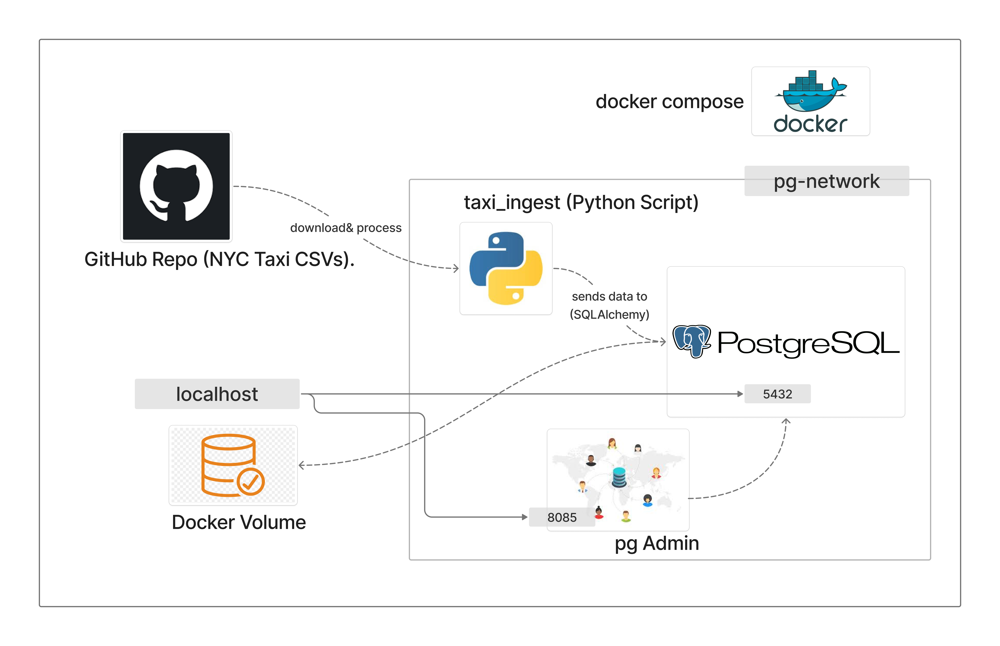

#  NYC Taxi Data Pipeline (Dockerized)

##  Overview
This project is an automated **End-to-End ETL pipeline** that fetches NYC Yellow Taxi trip records from GitHub, processes them in chunks using Python, and stores them in a structured PostgreSQL database.

It demonstrates containerization and data engineering best practices learned from the **Data Engineering Zoomcamp**.

---

##  System Architecture
The following diagram illustrates the infrastructure and data flow:



### Architecture Highlights:
- **Ingestion Logic**: Uses `Pandas` chunking (100k rows) to efficiently handle large CSV files without exhausting system memory.
- **Persistence**: Data is saved in a **Named Docker Volume** (`ny_taxi_postgres_data`) to ensure data remains safe even if the container is removed.
- **Networking**: Containers communicate over an isolated `pg-network` using service names as hostnames.
- **Orchestration**: Managed via `docker-compose` for easy, one-click deployment of the entire stack.

---

## 🛠️ Prerequisites
Before running the project, ensure you have the following installed:
- **Docker & Docker Compose**
- **Python 3.13** (Optional, if running scripts outside Docker)
- **uv** (Recommended for fast Python dependency management)

---

##  How to Run

### 1. Build the Ingestion Image
```bash
docker build -t taxi_ingest:v001 .
```

### 2. Start Services (Postgres & pgAdmin)
```bash
docker-compose up -d
```

### 3. Run Ingestion for a Specific Month
To ingest data for February 2021, run:
```bash
docker-compose run taxi_ingest --month=2 --year=2021
```

---

##  Sample SQL Analysis
Once the data is loaded, you can use pgAdmin at `http://localhost:8085` to run queries like:

### Check Total Record Count
```sql
SELECT COUNT(*) FROM yellow_taxi_trips;
```

### Analyze Daily Trip Counts
```sql
SELECT 
    DATE(tpep_pickup_datetime) AS pickup_date,
    COUNT(*) AS trips_count
FROM yellow_taxi_trips
GROUP BY 1
ORDER BY 1;
```

---

##  Environment Configuration
Default settings used in this project:

- **Database User**: root  
- **Database Password**: root  
- **Database Name**: ny_taxi  
- **Postgres Port**: 5432  
- **pgAdmin Port**: 8085  

---

##  Project Structure
- `ingest_data.py`: Main ETL logic using SQLAlchemy and Pandas
- `Dockerfile`: Multi-stage build for a lean ingestion environment
- `docker-compose.yaml`: Orchestration file for the database and management tools
- `pyproject.toml`: Dependency tracking via uv

---


**Source**: This project is based on Module 1 of the Data Engineering Zoomcamp.

---
